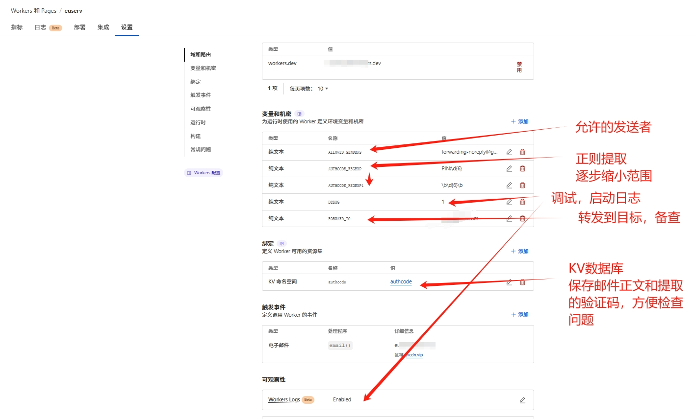

# email-authcode-api

## 0 使用场景
 自动解析邮件验证码，比如 euserv 的续期合同，自动获取解析后的验证码，方便自动续期。

 关键是免费。
 

## 1 创建 电子邮件Worker 

```js
// code from dist/bundle.js

```
 
## 2 设置



 

## 3 Gmail 转发
    自己百度一下吧。 

    注意，收到的转发的邮件的发送者地址，不是自己邮箱的地址，而是一个类似这样的地址

    ```
    <yourname>+caf_=xxxxx=xxxxx.xxxx@gmail.com
    ```
## 4 日志查看


## 5 KV数据库查看验证码和邮件正文


## 6 获取验证码
    
```
    https://<workerurl>/<urlencode(<yourname>+caf_=xxxxx=xxxxx.xxxx@gmail.com)
```
